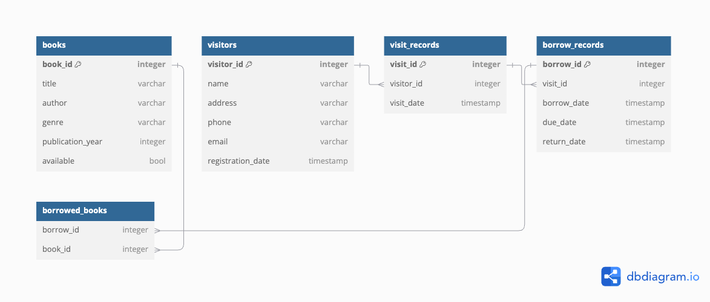

# SQL Project: Library Database

## Goals
- Design the database
- Create the database with DDL
- Insert data to the database with DML
- Query the database to get insights

## Deliverables
### 1. Database Design


### 2. Database Creation
```sql
do  $$
begin
	if not exists (select 1 from information_schema.tables
					where
						table_schema = 'library' and
						table_name = 'books') then
		-- Create Books Table
		create table library.books (
			book_id serial primary key,
			title text not null,
			author text not null,
			genre text,
			publication_year integer,
			available bool not null
		);
	end if;


	if not exists (select 1 from information_schema.tables
					where
						table_schema = 'library' and
						table_name = 'visitors') then
		-- Create Visitors Table
		create table library.visitors (
			visitor_id serial primary key,
			name text not null,
			address text,
			phone text,
			email text unique not null,
			registration_date timestamp with time zone default now()
		);
	end if;


	if not exists (select 1 from information_schema.tables
					where
						table_schema = 'library' and
						table_name = 'visit_records') then
		-- Create Visit Records Table
		create table library.visit_records (
			visit_id serial primary key,
			visitor_id integer references visitors(visitor_id),
			visit_date timestamp with time zone default now()
		);
	end if;


	if not exists (select 1 from information_schema.tables
					where
						table_schema = 'library' and
						table_name = 'borrow_records') then
		-- Create Borrow Records Table
		create table library.borrow_records (
			borrow_id serial primary key,
			visit_id integer references visit_records(visit_id),
			borrow_date timestamp with time zone default now(),
			due_date timestamp with time zone,
			return_date timestamp with time zone
		);
	end if;

	
	-- Create Borrowed Books Table
	if not exists (select 1 from information_schema.tables
					where
						table_schema = 'library' and
						table_name = 'borrowed_books') then
		create table library.borrowed_books (
			borrow_id integer,
			book_id integer
		);
	end if;

end $$;
```

### 3. Data Insertion
#### Books Table
```sql
insert into "library".books (title, author, genre, publication_year, available) values ('Polytechnique', 'Shermie Patchett', 'Crime|Drama', 2008, false);
insert into "library".books (title, author, genre, publication_year, available) values ('Combat dans L''Ile, Le (Fire and Ice)', 'Ingeborg Woolland', 'Drama', 2011, false);
insert into "library".books (title, author, genre, publication_year, available) values ('Royal Scandal, The', 'Filberte Duckinfield', 'Crime|Mystery', 2005, false);
insert into "library".books (title, author, genre, publication_year, available) values ('Felix the Cat: The Movie', 'Albert France', 'Adventure|Animation|Children|Fantasy|Musical|Sci-Fi', 2009, true);
insert into "library".books (title, author, genre, publication_year, available) values ('Bilitis', 'Augustin Gorey', 'Drama|Romance', 1986, false);
```

#### Visitors Table
```sql
insert into "library".visitors (name, address, phone, email, registration_date) values ('Kingston Balint', '91 Troy Junction', '531-426-3277', 'kbalint0@census.gov', '2023-12-01');
insert into "library".visitors (name, address, phone, email, registration_date) values ('Noni Scupham', '274 Derek Terrace', '619-591-0822', 'nscupham1@e-recht24.de', '2024-01-01');
insert into "library".visitors (name, address, phone, email, registration_date) values ('Kalle Brimming', '06828 Lien Circle', '317-176-8506', 'kbrimming2@marketwatch.com', '2024-08-22');
insert into "library".visitors (name, address, phone, email, registration_date) values ('Freeland Hundey', '206 Barnett Place', '203-683-0410', 'fhundey3@economist.com', '2023-12-22');
insert into "library".visitors (name, address, phone, email, registration_date) values ('Lauretta Casson', '5026 Kensington Terrace', '698-319-2067', 'lcasson4@desdev.cn', '2024-06-06');
```

### 4. Data Query
<!-- <INSERT DATA QUERY HERE> -->

